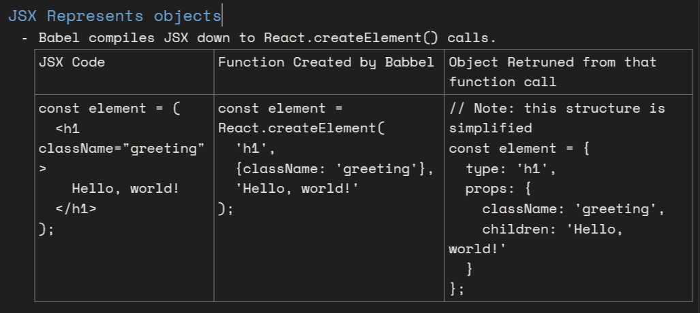
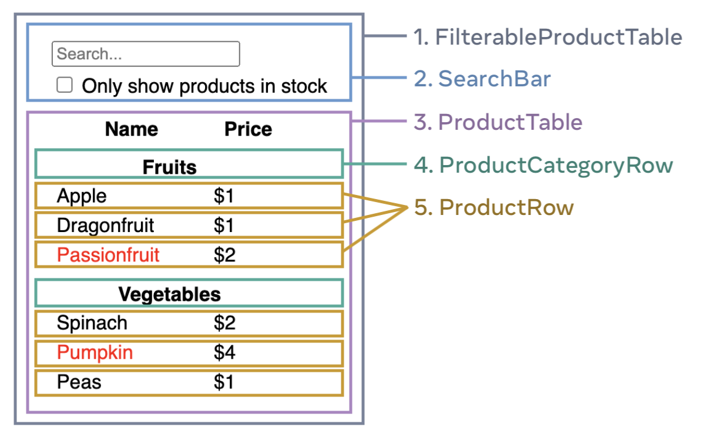

# Component Basics

**[JSX](https://react.dev/learn/writing-markup-with-jsx "official-doc") :** jsx stands for JavaScript XML. it allows writing HTML in javascript and converts the HTML tags into React elements.

When you see the jsx syntex it will feel like the HTML, but its more stricter then HTML and can display dynamic information.



**JSX Prevents Injection Attacks :  By default if you see above React DOM excapes any values embedded in jsx before rendering them this ensures that we can never inject anything that's not explicitly written in our application. So everything is converted into string before being rendered which helps prevent XSS(cross-site-scripting) attacks.**

## Rules of JSX

- Return a single root element, if there are multiple elements then wrap them inside single parent.
  - div : if we use container like div to be parent then it will insert extra node in DOM.
  - Fragment `<>` : we can use fragment to save us from not inserting extra node in DOM.
- Close all tags
  - Every tag must have there closing tags as well. eg 1. `<h1> hello world </h1> ` 2. Or we can write this way as well < MyComponent />.
- CamelCase : in javascript we have language constraints like we can't create identifiers with space between them or we can't use hyphen in between the name of identifier. And reserved keywords like `class` that's why all in html counterpart are represented as camelCase eg. `class in html, but className in jsx`.
- Booleans, Null and undefined are ignored, `exception : falsy value 0 will be rendered.`
  - these all will render same way, `<div /> ,  <div> </div>, <div>{false/null/undefined/true} </div>. Which is no visually appearing elements.`


## [What is transpillers and polyfills](https://javascript.info/polyfills)


## Props vs State

- Props short for properties, a immutable data passed from parent to a child component. They allow to pass data and event handlers down the component tree, enabling child components to be dynamic and reusable.
- State : these are also called componenet memory, react manages it outside the component since we know that once the component function runs all the variables created in that will the de-allocated as normal life-cycle of any program, so React has to manage them outside of the component.

  - They introduce the dynamic nature in our component, since changing them will re-renders our component.
  - They use different techniques to check whether to re-render or not.
    - Primitive : they compare the values for primitive.
    - Reference types : they compare them by memory location not by the fields of it.

  **Note : props changes when the parent component re-renders. While state changes when the component's internal data is updated.**
- Child Prop : As we can see in compiled jsx version, there is special property `children` which help us to get the all content defined in the tag. And it's widely used when designing the high-level components.

## Conditional Rendering

- This is way to render some dom element based on certain condition.

  ```javascript
  return (
  <div> 
    {isLoggedIn ? <h1> Welcome back! </h1> : <h1>Please sign up. </h1>}
  </div>
  );
  ```

## Thinking in terms of UI and Composition


