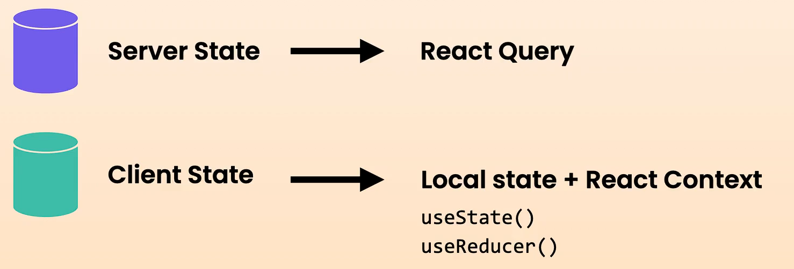

# Context API

The React Context API is used to manage and share state or data across different components without having to pass props down through every level of the component tree. It helps solve the problem of "prop drilling," where props need to be passed down manually at each level, even if intermediate components don't use the data.

Here are some reasons why you might use the React Context API:

1. **Avoid Prop Drilling** : Context allows you to pass data directly from a parent component to any deeply nested child component without manually passing it through every intermediate component.
2. **Global State Management** : It's useful for managing global data like themes, user authentication status, or any kind of app-wide settings that need to be accessible from many parts of the application.
3. **Lightweight Solution** : For simpler state management needs, using Context can be a more lightweight and built-in alternative to external libraries like Redux or MobX.
4. **Easy to Implement** : React Context API is built directly into React, making it easy to use without needing to install or configure additional libraries.



**Note :** anytime something changes in context any component that uses that context re-renders. And in this we use `React.memo` HOC to optimize our intermediate components from un-necessary re-renders.

## How context or any react things get compared

1. React uses `object.is` method for comparing, both primitive and non-primitive types.
2. It helps to deal with the below edge cases.

   ```javascript
   // how === treates below comparisons
   NaN === NaN;  // false
   Object.is(NaN, NaN);  // true

   -0 === +0;  // true
   Object.is(-0, +0);  // false

   console.log(Object.is(25, 25));        // true
   console.log(Object.is('foo', 'foo'));  // true
   console.log(Object.is([], []));        // false (different object references)
   console.log(Object.is(NaN, NaN));      // true
   console.log(Object.is(0, -0));         // false
   console.log(Object.is(-0, -0));        // true

   ```

## Pitfall of useContext

`useContext()` always looks for the closest provider *above* the component that calls it. It searches upwards and **does not** consider providers in the component from which you're calling `useContext()`.

If React can't find any providers of that particular **context** in the parent tree, the context value returned by `useContext()` will be equal to the **default value** that you specified when you have created the context.

`const ThemeContext = createContext(null);`

## What context uses to update it's state

if you see context just provides the data to the subscribers of it, but when it comes to update the data which is used in context that itself is done using either by useState of useReducer hooks.

**Note :**  Kindly see the example it has pitfall scenario also defined there.
